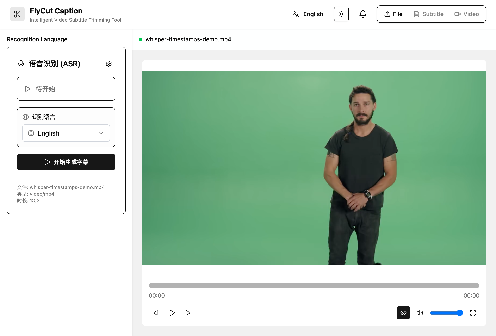

# FlyCut Caption - AI-Powered Video Subtitle Editing Tool

<div align="center">


A powerful AI-driven video subtitle editing tool focused on intelligent subtitle generation, editing, and video clipping.

[English](README.md) | [中文](README.zh.md)

</div>

## ✨ Features

### 🎯 Core Features
- **🎤 Intelligent Speech Recognition**: High-precision speech-to-text based on Whisper model, supporting multiple languages
- **✂️ Visual Subtitle Editing**: Intuitive subtitle segment selection and deletion interface
- **🎬 Real-time Video Preview**: Video player synchronized with subtitles, supporting interval playback
- **📤 Multi-format Export**: Support for SRT, JSON subtitle formats and video file export
- **🎨 Subtitle Style Customization**: Custom subtitle fonts, colors, positions and other styles
- **🌐 Internationalization Support**: Componentized internationalization design, supporting Chinese, English, and custom language packs (such as Japanese examples)

### 🔧 Technical Features
- **⚡ Modern Tech Stack**: React 19 + TypeScript + Vite + Tailwind CSS
- **🧠 Local AI Processing**: Using Hugging Face Transformers.js to run AI models locally in the browser
- **🎯 Web Workers**: ASR processing runs in background threads without blocking the main interface
- **📱 Responsive Design**: Modern interface adapted to different screen sizes
- **🎪 Component Architecture**: Modular design, easy to maintain and extend

## 🚀 Quick Start

### Prerequisites
- Node.js 18+
- pnpm (recommended) or npm

### Installation Steps

1. **Clone the project**
```bash
git clone https://github.com/x007xyz/flycut-caption.git
cd flycut-caption
```

2. **Install dependencies**
```bash
pnpm install
```

3. **Start development server**
```bash
pnpm dev
```

4. **Open browser**
```
http://localhost:5173
```

### Build for Production
```bash
# Build project
pnpm build

# Preview build result
pnpm preview
```

## 📋 User Guide

### 1. Upload Video Files
- Supported formats: MP4, WebM, AVI, MOV
- Supported audio: MP3, WAV, OGG
- Drag and drop files to upload area or click to select files


After uploading, enter the ASR configuration interface:



### 2. Generate Subtitles
- Select recognition language (supports Chinese, English and other languages)
- Click start recognition, AI will automatically generate timestamped subtitles
- Recognition process runs in background without affecting interface operations


### 3. Edit Subtitles
- **Select segments**: Choose subtitle segments to delete from the list
- **Batch operations**: Support select all, batch delete, undo delete operations
- **Real-time preview**: Click subtitle segments to jump to corresponding time points
- **History records**: Support undo/redo operations


### 4. Video Preview
- **Preview mode**: Automatically skip deleted segments to preview final result
- **Keyboard shortcuts**:
  - `Space`: Play/Pause
  - `←/→`: Rewind/Fast forward 5 seconds
  - `Shift + ←/→`: Rewind/Fast forward 10 seconds
  - `↑/↓`: Adjust volume
  - `M`: Mute/Unmute
  - `F`: Fullscreen

### 5. Subtitle Styling
- **Font settings**: Font size, weight, color
- **Position adjustment**: Subtitle display position, alignment
- **Background style**: Background color, transparency, border
- **Real-time preview**: WYSIWYG style adjustment

### 6. Export Results
- **Subtitle export**: SRT format (universal subtitle format), JSON format
- **Video export**:
  - Keep only non-deleted segments
  - Option to burn subtitles into video
  - Support different quality settings
  - Multiple format outputs

## 🌐 Internationalization Design

FlyCut Caption adopts componentized internationalization design, supporting flexible language pack management and real-time language switching. The component can automatically sync external language changes with internal UI components.

### Built-in Language Packs

```tsx
import { FlyCutCaption, zhCN, enUS } from '@flycut/caption-react'

// Use built-in Chinese language pack
<FlyCutCaption
  config={{ language: 'zh' }}
  locale={zhCN}
/>

// Use built-in English language pack
<FlyCutCaption
  config={{ language: 'en' }}
  locale={enUS}
/>
```

### Custom Language Packs

```tsx
import { FlyCutCaption, type FlyCutCaptionLocale } from '@flycut/caption-react'

// Create custom language pack (Japanese example)
const customJaJP: FlyCutCaptionLocale = {
  common: {
    loading: '読み込み中...',
    error: 'エラー',
    success: '成功',
    confirm: '確認',
    cancel: 'キャンセル',
    ok: 'OK',
    // ... more common translations
  },
  components: {
    fileUpload: {
      dragDropText: 'ビデオファイルをここにドラッグするか、クリックして選択',
      selectFile: 'ファイルを選択',
      supportedFormats: 'サポート形式：',
      // ... more component translations
    },
    subtitleEditor: {
      title: '字幕エディター',
      addSubtitle: '字幕を追加',
      deleteSelected: '選択項目を削除',
      // ... more editor translations
    },
    // ... other component translations
  },
  messages: {
    fileUpload: {
      uploadSuccess: 'ファイルアップロード成功',
      uploadFailed: 'ファイルアップロード失敗',
      // ... more message translations
    },
    // ... other message translations
  }
}

// Use custom language pack
<FlyCutCaption
  config={{ language: 'ja' }}
  locale={customJaJP}
/>
```

### Componentized Language Switching

The new componentized approach provides better language synchronization between external controls and internal components:

```tsx
import { useState } from 'react'
import { FlyCutCaption, zhCN, enUS, type FlyCutCaptionLocale } from '@flycut/caption-react'

function App() {
  const [currentLanguage, setCurrentLanguage] = useState('zh')
  const [currentLocale, setCurrentLocale] = useState<FlyCutCaptionLocale | undefined>(undefined)

  const handleLanguageChange = (language: string) => {
    console.log('Language switched to:', language)
    setCurrentLanguage(language)

    // Set corresponding language pack based on language
    switch (language) {
      case 'zh':
      case 'zh-CN':
        setCurrentLocale(zhCN)
        break
      case 'en':
      case 'en-US':
        setCurrentLocale(enUS)
        break
      case 'ja':
      case 'ja-JP':
        setCurrentLocale(customJaJP) // Custom Japanese pack
        break
      default:
        setCurrentLocale(undefined) // Use default language pack
    }
  }

  return (
    <div className="min-h-screen bg-background">
      <div className="container mx-auto py-8">
        <h1 className="text-3xl font-bold text-center mb-8">
          FlyCut Caption Internationalization Demo
        </h1>

        {/* External Language Controls */}
        <div className="mb-8 text-center space-y-4">
          <div>
            <h2 className="text-xl font-semibold mb-4">Language Switcher</h2>
            <div className="flex justify-center gap-4">
              <button
                className={`px-4 py-2 rounded ${currentLanguage === 'zh' ? 'bg-primary text-primary-foreground' : 'bg-secondary'}`}
                onClick={() => handleLanguageChange('zh')}
              >
                中文 (Built-in)
              </button>
              <button
                className={`px-4 py-2 rounded ${currentLanguage === 'en' ? 'bg-primary text-primary-foreground' : 'bg-secondary'}`}
                onClick={() => handleLanguageChange('en')}
              >
                English (Built-in)
              </button>
              <button
                className={`px-4 py-2 rounded ${currentLanguage === 'ja' ? 'bg-primary text-primary-foreground' : 'bg-secondary'}`}
                onClick={() => handleLanguageChange('ja')}
              >
                日本語 (Custom)
              </button>
            </div>
          </div>

          <div className="bg-muted p-4 rounded-lg">
            <p className="text-sm">
              <strong>Current Language:</strong> {currentLanguage}
            </p>
            <p className="text-sm">
              <strong>Language Pack Type:</strong> {currentLocale ? 'Custom Language Pack' : 'Built-in Language Pack'}
            </p>
          </div>
        </div>

        {/* FlyCut Caption Component */}
        <div className="border rounded-lg p-4">
          <h2 className="text-xl font-semibold mb-4">FlyCut Caption Component</h2>
          <FlyCutCaption
            config={{
              theme: 'auto',
              language: currentLanguage,
              enableThemeToggle: true,
              enableLanguageSelector: true  // Internal language selector will sync with external changes
            }}
            locale={currentLocale}
            onLanguageChange={handleLanguageChange}  // Sync internal changes back to external state
            onError={(error) => {
              console.error('Component error:', error)
            }}
            onProgress={(stage, progress) => {
              console.log(`Progress: ${stage} - ${progress}%`)
            }}
          />
        </div>
      </div>
    </div>
  )
}
```

### Available Language Packs

| Language | Import | Description |
|----------|---------|-------------|
| Chinese (Simplified) | `zhCN` | 简体中文 |
| English (US) | `enUS` | English (United States) |
| Default | `defaultLocale` | Same as `zhCN` |

### Language Pack API

```tsx
// Import language pack utilities
import { LocaleProvider, useLocale, useTranslation } from '@flycut/caption-react'

// Use LocaleProvider for nested components
<LocaleProvider language="zh" locale={zhCN}>
  <YourComponent />
</LocaleProvider>

// Access language pack context
const { t, setLanguage, registerLocale } = useLocale()

// Register custom language pack
registerLocale('fr', frenchLocale)

// Programmatic language switching
setLanguage('fr')
```

📚 **Detailed internationalization guide**: See [INTERNATIONALIZATION.md](./INTERNATIONALIZATION.md) for complete documentation on language packs, custom localization and advanced i18n features.

## 📚 Usage Guide

### 1. Installation & Setup

```bash
# Install package
npm install @flycut/caption-react

# TypeScript projects don't need additional type packages
# Type definitions are included
```

### 2. Import Styles

The component requires CSS styles to work properly:

```tsx
import '@flycut/caption-react/styles'
// or specific CSS file
import '@flycut/caption-react/dist/caption-react.css'
```

### 3. Basic Integration

```tsx
import { FlyCutCaption } from '@flycut/caption-react'
import '@flycut/caption-react/styles'

function VideoEditor() {
  return (
    <div className="video-editor-container">
      <FlyCutCaption />
    </div>
  )
}
```

### 4. Event Handling

```tsx
import { FlyCutCaption } from '@flycut/caption-react'

function VideoEditorWithEvents() {
  const handleFileSelected = (file: File) => {
    console.log('Selected file:', file.name, file.size)
  }

  const handleSubtitleGenerated = (subtitles: SubtitleChunk[]) => {
    console.log('Generated subtitles:', subtitles.length)
    // Save subtitles to backend
    saveSubtitles(subtitles)
  }

  const handleVideoProcessed = (blob: Blob, filename: string) => {
    // Handle processed video
    const url = URL.createObjectURL(blob)
    // Download or upload to server
    downloadFile(url, filename)
  }

  const handleError = (error: Error) => {
    // Handle errors gracefully
    console.error('FlyCut Caption error:', error)
    showErrorNotification(error.message)
  }

  return (
    <FlyCutCaption
      onFileSelected={handleFileSelected}
      onSubtitleGenerated={handleSubtitleGenerated}
      onVideoProcessed={handleVideoProcessed}
      onError={handleError}
    />
  )
}
```

### 5. Configuration Options

```tsx
import { FlyCutCaption } from '@flycut/caption-react'

function ConfiguredEditor() {
  const config = {
    // Theme settings
    theme: 'dark' as const,

    // Language settings
    language: 'zh-CN',
    asrLanguage: 'zh',

    // Feature toggles
    enableDragDrop: true,
    enableExport: true,
    enableVideoProcessing: true,
    enableThemeToggle: true,
    enableLanguageSelector: true,

    // File constraints
    maxFileSize: 1000, // 1GB
    supportedFormats: ['mp4', 'webm', 'mov']
  }

  return (
    <FlyCutCaption config={config} />
  )
}
```

### 6. Custom Styling

```tsx
import { FlyCutCaption } from '@flycut/caption-react'
import './custom-styles.css'

function StyledEditor() {
  return (
    <FlyCutCaption
      className="my-custom-editor"
      style={{
        borderRadius: '8px',
        boxShadow: '0 4px 6px rgba(0, 0, 0, 0.1)'
      }}
    />
  )
}
```

```css
/* custom-styles.css */
.my-custom-editor {
  --flycut-primary: #10b981;
  --flycut-border-radius: 12px;
}

.my-custom-editor .subtitle-item {
  border-radius: var(--flycut-border-radius);
}
```

## 📖 API Reference

### FlyCutCaptionProps

| Property | Type | Default | Description |
|----------|------|---------|-------------|
| `className` | `string` | `undefined` | Custom CSS class name |
| `style` | `CSSProperties` | `undefined` | Custom inline styles |
| `config` | `FlyCutCaptionConfig` | `defaultConfig` | Component configuration |
| `locale` | `FlyCutCaptionLocale` | `undefined` | Custom language pack |
| `onReady` | `() => void` | `undefined` | Called when component is ready |
| `onFileSelected` | `(file: File) => void` | `undefined` | Called when a file is selected |
| `onSubtitleGenerated` | `(subtitles: SubtitleChunk[]) => void` | `undefined` | Called when subtitles are generated |
| `onSubtitleChanged` | `(subtitles: SubtitleChunk[]) => void` | `undefined` | Called when subtitles are changed |
| `onVideoProcessed` | `(blob: Blob, filename: string) => void` | `undefined` | Called when video processing is complete |
| `onExportComplete` | `(blob: Blob, filename: string) => void` | `undefined` | Called when export is complete |
| `onError` | `(error: Error) => void` | `undefined` | Called when an error occurs |
| `onProgress` | `(stage: string, progress: number) => void` | `undefined` | Called to report progress updates |
| `onLanguageChange` | `(language: string) => void` | `undefined` | Called when language changes |

### FlyCutCaptionConfig

| Property | Type | Default | Description |
|----------|------|---------|-------------|
| `theme` | `'light' \| 'dark' \| 'auto'` | `'auto'` | Theme mode |
| `language` | `string` | `'zh-CN'` | Interface language |
| `asrLanguage` | `string` | `'auto'` | ASR recognition language |
| `enableDragDrop` | `boolean` | `true` | Enable drag and drop file upload |
| `enableExport` | `boolean` | `true` | Enable export functionality |
| `enableVideoProcessing` | `boolean` | `true` | Enable video processing functionality |
| `enableThemeToggle` | `boolean` | `true` | Enable theme toggle button |
| `enableLanguageSelector` | `boolean` | `true` | Enable language selector |
| `maxFileSize` | `number` | `500` | Maximum file size in MB |
| `supportedFormats` | `string[]` | `['mp4', 'webm', 'avi', 'mov', 'mp3', 'wav', 'ogg']` | Supported file formats |

## 🎨 Styling

The component comes with built-in styles that you need to import:

```tsx
import '@flycut/caption-react/styles'
```

You can also customize the appearance by:

1. **CSS Custom Properties**: Override CSS variables for colors and spacing
2. **Custom CSS Classes**: Use the `className` prop to apply custom styles
3. **Theme Configuration**: Use the `theme` config option for light/dark modes

### CSS Variables

```css
:root {
  --flycut-primary: #3b82f6;
  --flycut-background: #ffffff;
  --flycut-foreground: #1f2937;
  --flycut-muted: #f3f4f6;
  --flycut-border: #e5e7eb;
}

.dark {
  --flycut-background: #111827;
  --flycut-foreground: #f9fafb;
  --flycut-muted: #374151;
  --flycut-border: #4b5563;
}
```

## 🏗️ Project Architecture

### Tech Stack
- **Frontend Framework**: React 19 with Hooks
- **Type Checking**: TypeScript 5.8
- **Build Tool**: Vite 7.1
- **Styling Solution**: Tailwind CSS 4.1 + Shadcn/ui
- **State Management**: Zustand + React Context
- **AI Model**: Hugging Face Transformers.js
- **Video Processing**: WebAV
- **Internationalization**: react-i18next

### Project Structure
```
src/
├── components/          # UI Components
│   ├── FileUpload/     # File upload component
│   ├── VideoPlayer/    # Video player
│   ├── SubtitleEditor/ # Subtitle editor
│   ├── ProcessingPanel/ # Processing panel
│   ├── ExportPanel/    # Export panel
│   └── ui/             # Basic UI components
├── hooks/              # Custom Hooks
├── services/           # Business service layer
│   ├── asrService.ts   # ASR speech recognition service
│   └── UnifiedVideoProcessor.ts # Video processing service
├── stores/             # State management
│   ├── appStore.ts     # Application global state
│   ├── historyStore.ts # Subtitle history records
│   └── themeStore.ts   # Theme state
├── types/              # TypeScript type definitions
├── utils/              # Utility functions
├── workers/            # Web Workers
│   └── asrWorker.ts    # ASR processing worker thread
└── locales/            # Internationalization files
```

### Core Modules

#### ASR Speech Recognition
- Local speech recognition based on Whisper model
- Web Workers background processing without blocking main thread
- Support multiple languages and audio formats
- Generate precise word-level timestamps

#### Subtitle Editor
- Visual subtitle segment management
- Support batch selection and operations
- Real-time video playback position synchronization
- History records and undo/redo functionality

#### Video Processing
- Local video processing based on WebAV
- Support interval clipping and merging
- Subtitle burn-in functionality
- Multiple output formats and quality options

## 🛠️ Development Guide

### Development Commands
```bash
# Start development server
pnpm dev

# Type checking
pnpm run typecheck

# Code linting
pnpm lint

# Build project
pnpm build

# Preview build
pnpm preview
```

### Adding New Components
Project uses Shadcn/ui component library:
```bash
pnpm dlx shadcn@latest add <component-name>
```

### Code Standards
- TypeScript strict mode
- ESLint + React related rules
- Functional components + Hooks
- Componentized and modular design

## 🎬 Video Processing

The component supports various video processing features:

### Supported Formats

- **Video**: MP4, WebM, AVI, MOV
- **Audio**: MP3, WAV, OGG

### Processing Options

- **Quality**: Low, Medium, High
- **Format**: MP4, WebM
- **Subtitle Processing**: Burn-in, Separate file
- **Audio Preservation**: Enabled by default

## 📱 Browser Support

- **Chrome** 88+
- **Firefox** 78+
- **Safari** 14+
- **Edge** 88+

## 💡 Examples & Best Practices

### Complete React Application

```tsx
import React, { useState, useCallback } from 'react'
import { FlyCutCaption, zhCN, enUS, type FlyCutCaptionLocale } from '@flycut/caption-react'
import '@flycut/caption-react/styles'

function VideoEditorApp() {
  const [language, setLanguage] = useState<'zh' | 'en'>('zh')
  const [subtitles, setSubtitles] = useState([])
  const [isProcessing, setIsProcessing] = useState(false)

  const locale = language === 'zh' ? zhCN : enUS

  const handleLanguageChange = useCallback((newLang: string) => {
    setLanguage(newLang as 'zh' | 'en')
  }, [])

  const handleSubtitleGenerated = useCallback((newSubtitles) => {
    setSubtitles(newSubtitles)
    // Auto-save to local storage
    localStorage.setItem('flycut-subtitles', JSON.stringify(newSubtitles))
  }, [])

  const handleProgress = useCallback((stage: string, progress: number) => {
    setIsProcessing(progress < 100)
  }, [])

  return (
    <div className="min-h-screen bg-gray-50">
      <header className="bg-white shadow-sm">
        <div className="max-w-7xl mx-auto px-4 py-4">
          <div className="flex justify-between items-center">
            <h1 className="text-2xl font-bold">Video Editor</h1>
            <div className="flex gap-2">
              <button
                onClick={() => handleLanguageChange('zh')}
                className={language === 'zh' ? 'btn-primary' : 'btn-secondary'}
              >
                中文
              </button>
              <button
                onClick={() => handleLanguageChange('en')}
                className={language === 'en' ? 'btn-primary' : 'btn-secondary'}
              >
                English
              </button>
            </div>
          </div>
        </div>
      </header>

      <main className="max-w-7xl mx-auto px-4 py-8">
        <div className="bg-white rounded-lg shadow-lg overflow-hidden">
          <FlyCutCaption
            config={{
              theme: 'auto',
              language,
              enableDragDrop: true,
              enableExport: true,
              maxFileSize: 1000
            }}
            locale={locale}
            onLanguageChange={handleLanguageChange}
            onSubtitleGenerated={handleSubtitleGenerated}
            onProgress={handleProgress}
            onError={(error) => {
              console.error('Error:', error)
              // Show user-friendly error message
              alert('An error occurred during processing, please try again')
            }}
          />
        </div>

        {isProcessing && (
          <div className="mt-4 text-center">
            <div className="inline-flex items-center px-4 py-2 bg-blue-100 rounded-lg">
              <div className="animate-spin rounded-full h-4 w-4 border-b-2 border-blue-600 mr-2"></div>
              Processing, please wait...
            </div>
          </div>
        )}

        {subtitles.length > 0 && (
          <div className="mt-8 bg-white rounded-lg shadow p-6">
            <h2 className="text-lg font-semibold mb-4">Generated Subtitles ({subtitles.length} items)</h2>
            <div className="text-sm text-gray-600">
              Subtitles have been automatically saved to local storage
            </div>
          </div>
        )}
      </main>
    </div>
  )
}

export default VideoEditorApp
```

### Next.js Integration

```tsx
// pages/editor.tsx
import dynamic from 'next/dynamic'
import { useState } from 'react'

// Dynamically import to avoid SSR issues
const FlyCutCaption = dynamic(
  () => import('@flycut/caption-react').then(mod => mod.FlyCutCaption),
  { ssr: false }
)

export default function EditorPage() {
  return (
    <div style={{ height: '100vh' }}>
      <FlyCutCaption
        config={{
          theme: 'auto',
          language: 'zh'
        }}
        onVideoProcessed={(blob, filename) => {
          // Handle video processing result
          const url = URL.createObjectURL(blob)
          window.open(url, '_blank')
        }}
      />
    </div>
  )
}
```

### Best Practices

1. **Always import styles**: The component requires CSS to work properly
2. **Handle errors gracefully**: Implement proper error boundaries and user feedback
3. **Optimize for performance**: Use dynamic imports for SSR applications
4. **Provide user feedback**: Show loading states and progress indicators
5. **Responsive design**: Ensure your container has appropriate height/width
6. **Accessibility**: The component includes ARIA labels and keyboard navigation
7. **Memory management**: Clean up blob URLs when components unmount

## 🔧 Development

### Prerequisites

- Node.js 18+
- pnpm 8+

### Setup

```bash
git clone https://github.com/x007xyz/flycut-caption.git
cd flycut-caption
pnpm install
```

### Development

```bash
# Start development server
pnpm dev

# Build library
pnpm run build:lib

# Build demo
pnpm run build:demo

# Lint code
pnpm lint

# Run test app
cd test-app && pnpm dev
```

## 🤝 Contributing

We welcome contributions of all kinds!

### How to Contribute
1. Fork this project
2. Create feature branch (`git checkout -b feature/AmazingFeature`)
3. Commit changes (`git commit -m 'Add some AmazingFeature'`)
4. Push to branch (`git push origin feature/AmazingFeature`)
5. Create Pull Request

### Contribution Types
- 🐛 Bug fixes
- ✨ New feature development
- 📝 Documentation improvements
- 🎨 UI/UX optimizations
- ⚡ Performance optimizations
- 🌐 Internationalization translations

## 📝 License

This project is licensed under the MIT License with additional terms:

- ✅ **Allowed**: Personal, educational, commercial use
- ✅ **Allowed**: Modification, distribution, creating derivative works
- ❌ **Prohibited**: Removing or modifying logos, watermarks, brand elements in the software interface
- ❌ **Prohibited**: Hiding or tampering with attribution statements

To remove brand elements, please contact FlyCut Team for explicit written permission.

See [LICENSE](LICENSE) file for details.

## 🙏 Acknowledgments

- [Hugging Face](https://huggingface.co/) - Excellent Transformers.js library
- [OpenAI Whisper](https://openai.com/research/whisper) - Powerful speech recognition model
- [Shadcn/ui](https://ui.shadcn.com/) - Elegant UI component library
- [WebAV](https://github.com/hughfenghen/WebAV) - Powerful web audio/video processing library

## 📞 Support

- 📧 Email: x007xyzabc@gmail.com
- 🐛 Issues: [GitHub Issues](https://github.com/x007xyz/flycut-caption/issues)
- 📖 Documentation: [API Docs](https://flycut.dev/docs)

---

<div align="center">

**If this project helps you, please give us a ⭐ Star!**

Made with ❤️ by FlyCut Team

</div>