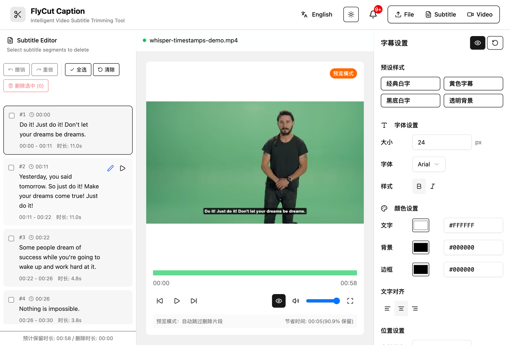
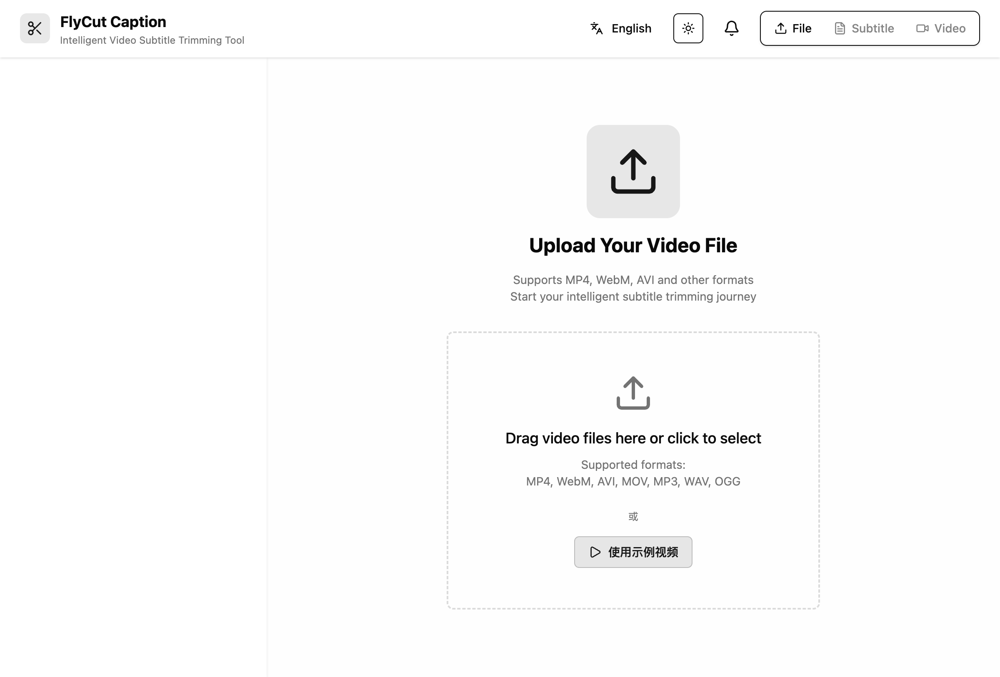
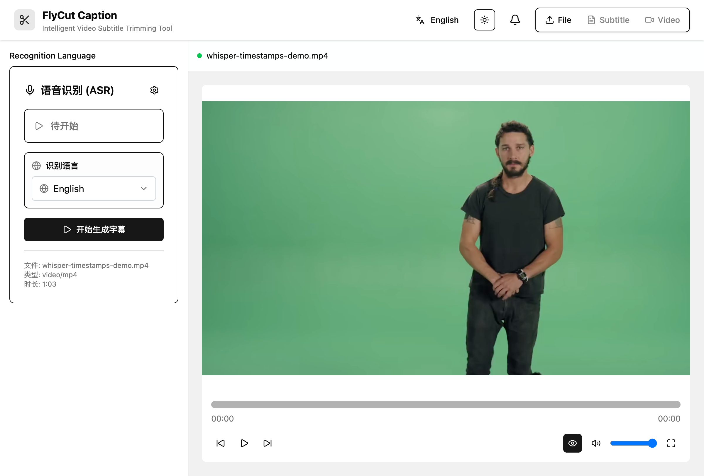
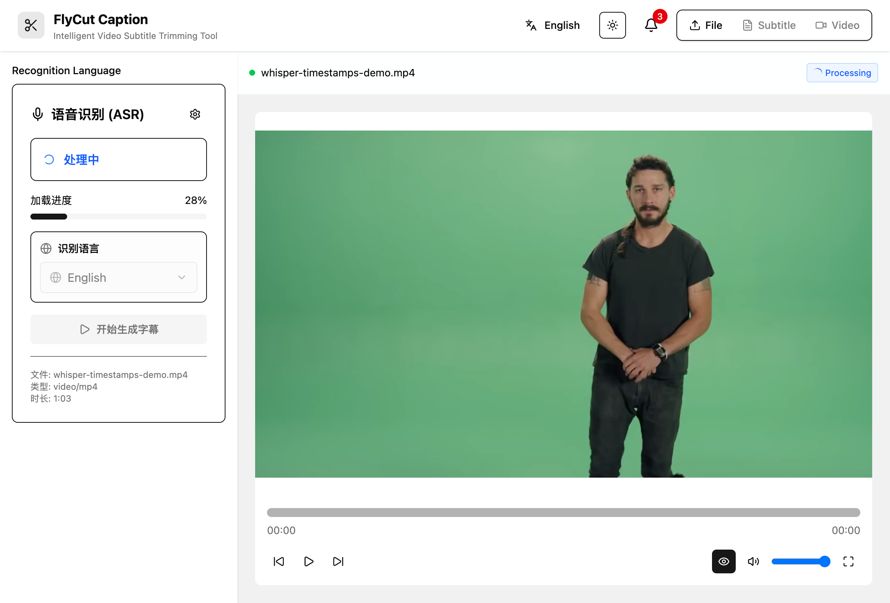

# FlyCut Caption - 智能视频字幕裁剪工具

<div align="center">



一个强大的 AI 驱动的视频字幕编辑工具，专注于智能字幕生成、编辑和视频裁剪。

[English](README.md) | [中文](README.zh.md)

</div>

## ✨ 功能特色

### 🎯 核心功能
- **🎤 智能语音识别**：基于 Whisper 模型的高精度语音转文字，支持多种语言
- **✂️ 可视化字幕编辑**：直观的字幕片段选择和删除界面
- **🎬 实时视频预览**：与字幕同步的视频播放器，支持区间播放
- **📤 多格式导出**：支持 SRT、JSON 字幕格式以及视频文件导出
- **🎨 字幕样式定制**：自定义字幕字体、颜色、位置等样式
- **🌐 国际化支持**：组件化国际化设计，支持中文、英文、自定义语言包（如日语示例）

### 🔧 技术特色
- **⚡ 现代化技术栈**：React 19 + TypeScript + Vite + Tailwind CSS
- **🧠 本地 AI 处理**：使用 Hugging Face Transformers.js 在浏览器本地运行 AI 模型
- **🎯 Web Workers**：ASR 处理在后台线程运行，不阻塞主界面
- **📱 响应式设计**：适配不同屏幕尺寸的现代化界面
- **🎪 组件化架构**：模块化设计，易于维护和扩展

## 🚀 快速开始

### 环境要求
- Node.js 18+
- pnpm (推荐) 或 npm

### 安装步骤

1. **克隆项目**
```bash
git clone https://github.com/x007xyz/flycut.git
cd flycut
```

2. **安装依赖**
```bash
pnpm install
```

3. **启动开发服务器**
```bash
pnpm dev
```

4. **打开浏览器**
```
http://localhost:5173
```

### 构建生产版本
```bash
# 构建项目
pnpm build

# 预览构建结果
pnpm preview
```

## 📋 使用指南

### 1. 上传视频文件
- 支持格式：MP4, WebM, AVI, MOV
- 支持音频：MP3, WAV, OGG
- 拖拽文件到上传区域或点击选择文件



上传完成后，进入ASR配置界面：



### 2. 生成字幕
- 选择识别语言（支持中文、英文等多种语言）
- 点击开始识别，AI 将自动生成带时间戳的字幕
- 识别过程在后台进行，不影响界面操作



### 3. 编辑字幕
- **选择片段**：在字幕列表中选择要删除的片段
- **批量操作**：支持全选、批量删除、恢复删除等操作
- **实时预览**：点击字幕片段可跳转到对应时间点
- **历史记录**：支持撤销/重做操作


### 4. 视频预览
- **预览模式**：自动跳过删除的片段，预览最终效果
- **快捷键支持**：
  - `空格`：播放/暂停
  - `←/→`：快退/快进 5 秒
  - `Shift + ←/→`：快退/快进 10 秒
  - `↑/↓`：调节音量
  - `M`：静音/取消静音
  - `F`：全屏

### 5. 字幕样式
- **字体设置**：字体大小、粗细、颜色
- **位置调整**：字幕显示位置、对齐方式
- **背景样式**：背景颜色、透明度、边框
- **实时预览**：所见即所得的样式调整

### 6. 导出结果
- **字幕导出**：SRT 格式（通用字幕格式）、JSON 格式
- **视频导出**：
  - 仅保留未删除的片段
  - 可选择烧录字幕到视频
  - 支持不同质量设置
  - 多种格式输出

## 🌐 国际化设计

FlyCut Caption 采用组件化国际化设计，支持灵活的语言包管理和实时语言切换。组件能够自动同步外部语言变化与内部 UI 组件。

### 内置语言包

```tsx
import { FlyCutCaption, zhCN, enUS } from '@flycut/caption-react'

// 使用内置中文语言包
<FlyCutCaption
  config={{ language: 'zh' }}
  locale={zhCN}
/>

// 使用内置英文语言包
<FlyCutCaption
  config={{ language: 'en' }}
  locale={enUS}
/>
```

### 自定义语言包

```tsx
import { FlyCutCaption, type FlyCutCaptionLocale } from '@flycut/caption-react'

// 创建自定义语言包（日语示例）
const customJaJP: FlyCutCaptionLocale = {
  common: {
    loading: '読み込み中...',
    error: 'エラー',
    success: '成功',
    confirm: '確認',
    cancel: 'キャンセル',
    ok: 'OK',
    // ... 更多通用翻译
  },
  components: {
    fileUpload: {
      dragDropText: 'ビデオファイルをここにドラッグするか、クリックして選択',
      selectFile: 'ファイルを選択',
      supportedFormats: 'サポート形式：',
      // ... 更多组件翻译
    },
    subtitleEditor: {
      title: '字幕エディター',
      addSubtitle: '字幕を追加',
      deleteSelected: '選択項目を削除',
      // ... 更多编辑器翻译
    },
    // ... 其他组件翻译
  },
  messages: {
    fileUpload: {
      uploadSuccess: 'ファイルアップロード成功',
      uploadFailed: 'ファイルアップロード失敗',
      // ... 更多消息翻译
    },
    // ... 其他消息翻译
  }
}

// 使用自定义语言包
<FlyCutCaption
  config={{ language: 'ja' }}
  locale={customJaJP}
/>
```

### 组件化语言切换

新的组件化方法提供外部控制与内部组件间更好的语言同步：

```tsx
import { useState } from 'react'
import { FlyCutCaption, zhCN, enUS, type FlyCutCaptionLocale } from '@flycut/caption-react'

function App() {
  const [currentLanguage, setCurrentLanguage] = useState('zh')
  const [currentLocale, setCurrentLocale] = useState<FlyCutCaptionLocale | undefined>(undefined)

  const handleLanguageChange = (language: string) => {
    console.log('语言已切换为:', language)
    setCurrentLanguage(language)

    // 根据语言设置相应的语言包
    switch (language) {
      case 'zh':
      case 'zh-CN':
        setCurrentLocale(zhCN)
        break
      case 'en':
      case 'en-US':
        setCurrentLocale(enUS)
        break
      case 'ja':
      case 'ja-JP':
        setCurrentLocale(customJaJP) // 自定义日语包
        break
      default:
        setCurrentLocale(undefined) // 使用默认语言包
    }
  }

  return (
    <div className="min-h-screen bg-background">
      <div className="container mx-auto py-8">
        <h1 className="text-3xl font-bold text-center mb-8">
          FlyCut Caption 国际化演示
        </h1>

        {/* 外部语言控制 */}
        <div className="mb-8 text-center space-y-4">
          <div>
            <h2 className="text-xl font-semibold mb-4">语言切换器</h2>
            <div className="flex justify-center gap-4">
              <button
                className={`px-4 py-2 rounded ${currentLanguage === 'zh' ? 'bg-primary text-primary-foreground' : 'bg-secondary'}`}
                onClick={() => handleLanguageChange('zh')}
              >
                中文 (内置)
              </button>
              <button
                className={`px-4 py-2 rounded ${currentLanguage === 'en' ? 'bg-primary text-primary-foreground' : 'bg-secondary'}`}
                onClick={() => handleLanguageChange('en')}
              >
                English (内置)
              </button>
              <button
                className={`px-4 py-2 rounded ${currentLanguage === 'ja' ? 'bg-primary text-primary-foreground' : 'bg-secondary'}`}
                onClick={() => handleLanguageChange('ja')}
              >
                日本語 (自定义)
              </button>
            </div>
          </div>

          <div className="bg-muted p-4 rounded-lg">
            <p className="text-sm">
              <strong>当前语言:</strong> {currentLanguage}
            </p>
            <p className="text-sm">
              <strong>语言包类型:</strong> {currentLocale ? '自定义语言包' : '内置语言包'}
            </p>
          </div>
        </div>

        {/* FlyCut Caption 组件 */}
        <div className="border rounded-lg p-4">
          <h2 className="text-xl font-semibold mb-4">FlyCut Caption 组件</h2>
          <FlyCutCaption
            config={{
              theme: 'auto',
              language: currentLanguage,
              enableThemeToggle: true,
              enableLanguageSelector: true  // 内部语言选择器将与外部变化同步
            }}
            locale={currentLocale}
            onLanguageChange={handleLanguageChange}  // 将内部变化同步回外部状态
            onError={(error) => {
              console.error('组件错误:', error)
            }}
            onProgress={(stage, progress) => {
              console.log(`进度: ${stage} - ${progress}%`)
            }}
          />
        </div>
      </div>
    </div>
  )
}
```

### 可用语言包

| 语言 | 导入方式 | 描述 |
|----------|---------|-------------|
| 中文（简体） | `zhCN` | 简体中文 |
| 英文（美式） | `enUS` | English (United States) |
| 默认 | `defaultLocale` | 与 `zhCN` 相同 |

### 语言包 API

```tsx
// 导入语言包工具
import { LocaleProvider, useLocale, useTranslation } from '@flycut/caption-react'

// 为嵌套组件使用 LocaleProvider
<LocaleProvider language="zh" locale={zhCN}>
  <YourComponent />
</LocaleProvider>

// 访问语言包上下文
const { t, setLanguage, registerLocale } = useLocale()

// 注册自定义语言包
registerLocale('fr', frenchLocale)

// 程序化语言切换
setLanguage('fr')
```

📚 **详细国际化指南**：查看 [INTERNATIONALIZATION.md](./INTERNATIONALIZATION.md) 了解完整的语言包、自定义本地化和高级国际化功能文档。

## 📚 使用指南

### 1. 安装与设置

```bash
# 安装包
npm install @flycut/caption-react

# TypeScript 项目无需额外类型包
# 类型定义已包含在内
```

### 2. 导入样式

组件需要 CSS 样式才能正常工作：

```tsx
import '@flycut/caption-react/styles'
// 或指定 CSS 文件
import '@flycut/caption-react/dist/caption-react.css'
```

### 3. 基础集成

```tsx
import { FlyCutCaption } from '@flycut/caption-react'
import '@flycut/caption-react/styles'

function VideoEditor() {
  return (
    <div className="video-editor-container">
      <FlyCutCaption />
    </div>
  )
}
```

### 4. 事件处理

```tsx
import { FlyCutCaption } from '@flycut/caption-react'

function VideoEditorWithEvents() {
  const handleFileSelected = (file: File) => {
    console.log('选择的文件:', file.name, file.size)
  }

  const handleSubtitleGenerated = (subtitles: SubtitleChunk[]) => {
    console.log('生成的字幕:', subtitles.length)
    // 保存字幕到后端
    saveSubtitles(subtitles)
  }

  const handleVideoProcessed = (blob: Blob, filename: string) => {
    // 处理生成的视频
    const url = URL.createObjectURL(blob)
    // 下载或上传到服务器
    downloadFile(url, filename)
  }

  const handleError = (error: Error) => {
    // 优雅处理错误
    console.error('FlyCut Caption 错误:', error)
    showErrorNotification(error.message)
  }

  return (
    <FlyCutCaption
      onFileSelected={handleFileSelected}
      onSubtitleGenerated={handleSubtitleGenerated}
      onVideoProcessed={handleVideoProcessed}
      onError={handleError}
    />
  )
}
```

### 5. 配置选项

```tsx
import { FlyCutCaption } from '@flycut/caption-react'

function ConfiguredEditor() {
  const config = {
    // 主题设置
    theme: 'dark' as const,

    // 语言设置
    language: 'zh-CN',
    asrLanguage: 'zh',

    // 功能开关
    enableDragDrop: true,
    enableExport: true,
    enableVideoProcessing: true,
    enableThemeToggle: true,
    enableLanguageSelector: true,

    // 文件限制
    maxFileSize: 1000, // 1GB
    supportedFormats: ['mp4', 'webm', 'mov']
  }

  return (
    <FlyCutCaption config={config} />
  )
}
```

### 6. 自定义样式

```tsx
import { FlyCutCaption } from '@flycut/caption-react'
import './custom-styles.css'

function StyledEditor() {
  return (
    <FlyCutCaption
      className="my-custom-editor"
      style={{
        borderRadius: '8px',
        boxShadow: '0 4px 6px rgba(0, 0, 0, 0.1)'
      }}
    />
  )
}
```

```css
/* custom-styles.css */
.my-custom-editor {
  --flycut-primary: #10b981;
  --flycut-border-radius: 12px;
}

.my-custom-editor .subtitle-item {
  border-radius: var(--flycut-border-radius);
}
```

## 📖 API 参考

### FlyCutCaptionProps

| 属性 | 类型 | 默认值 | 描述 |
|------|------|---------|-------------|
| `className` | `string` | `undefined` | 自定义 CSS 类名 |
| `style` | `CSSProperties` | `undefined` | 自定义内联样式 |
| `config` | `FlyCutCaptionConfig` | `defaultConfig` | 组件配置 |
| `locale` | `FlyCutCaptionLocale` | `undefined` | 自定义语言包 |
| `onReady` | `() => void` | `undefined` | 组件就绪时调用 |
| `onFileSelected` | `(file: File) => void` | `undefined` | 选择文件时调用 |
| `onSubtitleGenerated` | `(subtitles: SubtitleChunk[]) => void` | `undefined` | 生成字幕时调用 |
| `onSubtitleChanged` | `(subtitles: SubtitleChunk[]) => void` | `undefined` | 字幕改变时调用 |
| `onVideoProcessed` | `(blob: Blob, filename: string) => void` | `undefined` | 视频处理完成时调用 |
| `onExportComplete` | `(blob: Blob, filename: string) => void` | `undefined` | 导出完成时调用 |
| `onError` | `(error: Error) => void` | `undefined` | 出现错误时调用 |
| `onProgress` | `(stage: string, progress: number) => void` | `undefined` | 进度更新时调用 |
| `onLanguageChange` | `(language: string) => void` | `undefined` | 语言变化时调用 |

### FlyCutCaptionConfig

| 属性 | 类型 | 默认值 | 描述 |
|----------|------|---------|-------------|
| `theme` | `'light' \| 'dark' \| 'auto'` | `'auto'` | 主题模式 |
| `language` | `string` | `'zh-CN'` | 界面语言 |
| `asrLanguage` | `string` | `'auto'` | ASR 识别语言 |
| `enableDragDrop` | `boolean` | `true` | 启用拖拽文件上传 |
| `enableExport` | `boolean` | `true` | 启用导出功能 |
| `enableVideoProcessing` | `boolean` | `true` | 启用视频处理功能 |
| `enableThemeToggle` | `boolean` | `true` | 启用主题切换按钮 |
| `enableLanguageSelector` | `boolean` | `true` | 启用语言选择器 |
| `maxFileSize` | `number` | `500` | 最大文件大小（MB） |
| `supportedFormats` | `string[]` | `['mp4', 'webm', 'avi', 'mov', 'mp3', 'wav', 'ogg']` | 支持的文件格式 |

## 🎨 样式定制

组件自带内置样式，需要导入：

```tsx
import '@flycut/caption-react/styles'
```

您也可以通过以下方式自定义外观：

1. **CSS 自定义属性**：覆盖颜色和间距的 CSS 变量
2. **自定义 CSS 类**：使用 `className` 属性应用自定义样式
3. **主题配置**：使用 `theme` 配置选项切换明暗模式

### CSS 变量

```css
:root {
  --flycut-primary: #3b82f6;
  --flycut-background: #ffffff;
  --flycut-foreground: #1f2937;
  --flycut-muted: #f3f4f6;
  --flycut-border: #e5e7eb;
}

.dark {
  --flycut-background: #111827;
  --flycut-foreground: #f9fafb;
  --flycut-muted: #374151;
  --flycut-border: #4b5563;
}
```

## 🏗️ 项目架构

### 技术栈
- **前端框架**：React 19 with Hooks
- **类型检查**：TypeScript 5.8
- **构建工具**：Vite 7.1
- **样式方案**：Tailwind CSS 4.1 + Shadcn/ui
- **状态管理**：Zustand + React Context
- **AI 模型**：Hugging Face Transformers.js
- **视频处理**：WebAV
- **国际化**：react-i18next

### 项目结构
```
src/
├── components/          # UI 组件
│   ├── FileUpload/     # 文件上传组件
│   ├── VideoPlayer/    # 视频播放器
│   ├── SubtitleEditor/ # 字幕编辑器
│   ├── ProcessingPanel/ # 处理面板
│   ├── ExportPanel/    # 导出面板
│   └── ui/             # 基础 UI 组件
├── hooks/              # 自定义 Hooks
├── services/           # 业务服务层
│   ├── asrService.ts   # ASR 语音识别服务
│   └── UnifiedVideoProcessor.ts # 视频处理服务
├── stores/             # 状态管理
│   ├── appStore.ts     # 应用全局状态
│   ├── historyStore.ts # 字幕历史记录
│   └── themeStore.ts   # 主题状态
├── types/              # TypeScript 类型定义
├── utils/              # 工具函数
├── workers/            # Web Workers
│   └── asrWorker.ts    # ASR 处理工作线程
└── locales/            # 国际化文件
```

### 核心模块

#### ASR 语音识别
- 基于 Whisper 模型的本地语音识别
- Web Workers 后台处理，不阻塞主线程
- 支持多种语言和音频格式
- 生成精确的字级时间戳

#### 字幕编辑器
- 可视化的字幕片段管理
- 支持批量选择和操作
- 实时同步视频播放位置
- 历史记录和撤销/重做功能

#### 视频处理
- 基于 WebAV 的本地视频处理
- 支持区间裁剪和合并
- 字幕烧录功能
- 多种输出格式和质量选项

## 🛠️ 开发指南

### 开发命令
```bash
# 启动开发服务器
pnpm dev

# 类型检查
pnpm run typecheck

# 代码检查
pnpm lint

# 构建项目
pnpm build

# 预览构建
pnpm preview
```

### 添加新组件
项目使用 Shadcn/ui 组件库：
```bash
pnpm dlx shadcn@latest add <component-name>
```

### 代码规范
- TypeScript 严格模式
- ESLint + React 相关规则
- 函数式组件 + Hooks
- 组件化和模块化设计

## 🎬 视频处理

组件支持各种视频处理功能：

### 支持的格式

- **视频**：MP4, WebM, AVI, MOV
- **音频**：MP3, WAV, OGG

### 处理选项

- **质量**：低、中、高
- **格式**：MP4、WebM
- **字幕处理**：烧录、单独文件
- **音频保留**：默认启用

## 📱 浏览器支持

- **Chrome** 88+
- **Firefox** 78+
- **Safari** 14+
- **Edge** 88+

## 💡 示例与最佳实践

### 完整 React 应用程序

```tsx
import React, { useState, useCallback } from 'react'
import { FlyCutCaption, zhCN, enUS, type FlyCutCaptionLocale } from '@flycut/caption-react'
import '@flycut/caption-react/styles'

function VideoEditorApp() {
  const [language, setLanguage] = useState<'zh' | 'en'>('zh')
  const [subtitles, setSubtitles] = useState([])
  const [isProcessing, setIsProcessing] = useState(false)

  const locale = language === 'zh' ? zhCN : enUS

  const handleLanguageChange = useCallback((newLang: string) => {
    setLanguage(newLang as 'zh' | 'en')
  }, [])

  const handleSubtitleGenerated = useCallback((newSubtitles) => {
    setSubtitles(newSubtitles)
    // 自动保存到本地存储
    localStorage.setItem('flycut-subtitles', JSON.stringify(newSubtitles))
  }, [])

  const handleProgress = useCallback((stage: string, progress: number) => {
    setIsProcessing(progress < 100)
  }, [])

  return (
    <div className="min-h-screen bg-gray-50">
      <header className="bg-white shadow-sm">
        <div className="max-w-7xl mx-auto px-4 py-4">
          <div className="flex justify-between items-center">
            <h1 className="text-2xl font-bold">视频编辑器</h1>
            <div className="flex gap-2">
              <button
                onClick={() => handleLanguageChange('zh')}
                className={language === 'zh' ? 'btn-primary' : 'btn-secondary'}
              >
                中文
              </button>
              <button
                onClick={() => handleLanguageChange('en')}
                className={language === 'en' ? 'btn-primary' : 'btn-secondary'}
              >
                English
              </button>
            </div>
          </div>
        </div>
      </header>

      <main className="max-w-7xl mx-auto px-4 py-8">
        <div className="bg-white rounded-lg shadow-lg overflow-hidden">
          <FlyCutCaption
            config={{
              theme: 'auto',
              language,
              enableDragDrop: true,
              enableExport: true,
              maxFileSize: 1000
            }}
            locale={locale}
            onLanguageChange={handleLanguageChange}
            onSubtitleGenerated={handleSubtitleGenerated}
            onProgress={handleProgress}
            onError={(error) => {
              console.error('错误:', error)
              // 显示用户友好的错误消息
              alert('处理过程中出现错误，请重试')
            }}
          />
        </div>

        {isProcessing && (
          <div className="mt-4 text-center">
            <div className="inline-flex items-center px-4 py-2 bg-blue-100 rounded-lg">
              <div className="animate-spin rounded-full h-4 w-4 border-b-2 border-blue-600 mr-2"></div>
              处理中，请稍候...
            </div>
          </div>
        )}

        {subtitles.length > 0 && (
          <div className="mt-8 bg-white rounded-lg shadow p-6">
            <h2 className="text-lg font-semibold mb-4">生成的字幕 ({subtitles.length} 条)</h2>
            <div className="text-sm text-gray-600">
              字幕已自动保存到本地存储
            </div>
          </div>
        )}
      </main>
    </div>
  )
}

export default VideoEditorApp
```

### Next.js 集成

```tsx
// pages/editor.tsx
import dynamic from 'next/dynamic'
import { useState } from 'react'

// 动态导入以避免 SSR 问题
const FlyCutCaption = dynamic(
  () => import('@flycut/caption-react').then(mod => mod.FlyCutCaption),
  { ssr: false }
)

export default function EditorPage() {
  return (
    <div style={{ height: '100vh' }}>
      <FlyCutCaption
        config={{
          theme: 'auto',
          language: 'zh'
        }}
        onVideoProcessed={(blob, filename) => {
          // 处理视频处理结果
          const url = URL.createObjectURL(blob)
          window.open(url, '_blank')
        }}
      />
    </div>
  )
}
```

### 最佳实践

1. **始终导入样式**：组件需要 CSS 才能正常工作
2. **优雅处理错误**：实现适当的错误边界和用户反馈
3. **性能优化**：对 SSR 应用程序使用动态导入
4. **提供用户反馈**：显示加载状态和进度指示器
5. **响应式设计**：确保容器具有适当的高度/宽度
6. **无障碍性**：组件包含 ARIA 标签和键盘导航
7. **内存管理**：组件卸载时清理 blob URL

## 🔧 开发

### 环境要求

- Node.js 18+
- pnpm 8+

### 设置

```bash
git clone https://github.com/x007xyz/flycut.git
cd flycut
pnpm install
```

### 开发

```bash
# 启动开发服务器
pnpm dev

# 构建库
pnpm run build:lib

# 构建演示
pnpm run build:demo

# 代码检查
pnpm lint

# 运行测试应用
cd test-app && pnpm dev
```

## 🤝 贡献指南

我们欢迎各种形式的贡献！

### 如何贡献
1. Fork 本项目
2. 创建功能分支 (`git checkout -b feature/AmazingFeature`)
3. 提交更改 (`git commit -m 'Add some AmazingFeature'`)
4. 推送到分支 (`git push origin feature/AmazingFeature`)
5. 创建 Pull Request

### 贡献类型
- 🐛 Bug 修复
- ✨ 新功能开发
- 📝 文档改进
- 🎨 UI/UX 优化
- ⚡ 性能优化
- 🌐 国际化翻译

## 📝 许可证

本项目采用 MIT 许可证，但有以下额外条款：

- ✅ **允许**：个人、教育、商业用途
- ✅ **允许**：修改、分发、创建衍生作品
- ❌ **禁止**：移除或修改软件界面中的 Logo、水印、品牌元素
- ❌ **禁止**：隐藏或篡改归属声明

如需移除品牌元素，请联系 FlyCut Team 获得明确的书面许可。

详情请参阅 [LICENSE](LICENSE) 文件。

## 🙏 致谢

- [Hugging Face](https://huggingface.co/) - 提供优秀的 Transformers.js 库
- [OpenAI Whisper](https://openai.com/research/whisper) - 强大的语音识别模型
- [Shadcn/ui](https://ui.shadcn.com/) - 优雅的 UI 组件库
- [WebAV](https://github.com/hughfenghen/WebAV) - 强大的 Web 音视频处理库

## 📞 支持

- 📧 邮箱: x007xyzabc@gmail.com
- 🐛 问题反馈: [GitHub Issues](https://github.com/x007xyz/flycut/issues)
- 📖 文档: [API 文档](https://flycut.dev/docs)

---

<div align="center">

**如果这个项目对你有帮助，请给我们一个 ⭐ Star！**

Made with ❤️ by FlyCut Team

</div>